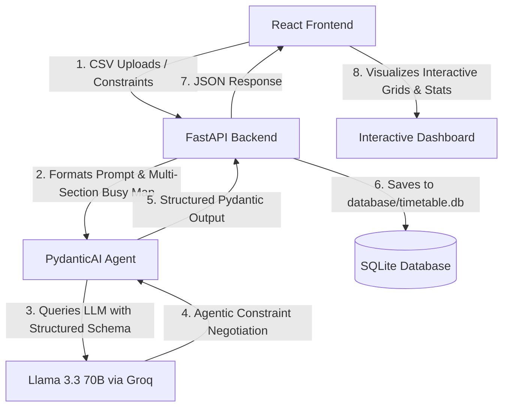

# 🎓 Mentor Presentation & Project Documentation Guide: T.I.T.A.N.

When presenting a high-caliber project like **T.I.T.A.N. (Timetable Intelligent Technology & Agentic Negotiator)** to your mentor, you should structure your documentation to demonstrate both **architectural depth** and **engineering rigor**. 

This document serves as your complete blueprint, detailing the technical components, system workflows, and key talking points designed to impress your mentor.

---

## 1. 🏗️ System Architecture & Workflow

Explain how the system uses a **decoupled Client-Server architecture** with a specialized **Agentic AI negotiation loop**.

### System Data Flow Diagram



### Key Architectural Pillars
1.  **Frontend (React + Vite)**: Handles client-side routing, CSV file parsing, global state management, and real-time analytical charts (utilizing Recharts and glassmorphic UI).
2.  **Backend (FastAPI)**: Serves high-speed asynchronous REST endpoints, manages CORS, handles SQLite database operations, and initiates the AI generation agent.
3.  **AI Layer (PydanticAI + Groq)**: Bypasses simple API wrappers. Uses **PydanticAI** to enforce strict structured data schemas directly from **Groq's Llama-3.3-70b-versatile** model, guaranteeing valid JSON responses every single run.
4.  **Database (SQLite)**: Persists master datasets and generated schedules locally in a decoupled `database/` folder.

---

## 2. 🤖 The Agentic AI Design (The "Brain")

Mentors are highly interested in *how* AI is integrated. Explain that T.I.T.A.N. uses **Agentic Negotiation** rather than a generic chatbot prompt.

### 💡 Core Concept: "Agentic Constraint Negotiation"
Traditional schedulers use hardcoded backtracking algorithms. T.I.T.A.N. uses an LLM Agent primed with a comprehensive, rule-based **System Prompt** to negotiate complex, multi-variable constraints:
*   **Section Clashes**: Analyzes a dynamic `faculty_busy_map` representing occupied slots from *other* sections to prevent a teacher from being scheduled in two places simultaneously.
*   **Diversity Constraints**: Randomized slot allocations across the week so schedules do not feel repetitive.
*   **Workload Balancing**: Distributes teaching hours evenly according to designated department caps.
*   **Static Subject Association**: Enforces consistent instructor assignments per subject within a section.

### Enforced Output Schema (Pydantic)
Point out that the agent doesn't return raw text. It strictly enforces a validated Pydantic model (`TimetableGenerationResponse`), converting LLM outputs into exact JSON records with days, timeslots, subjects, faculties, and classrooms.

---

## 3. 🔌 FastAPI Endpoint Specification

FastAPI automatically generates live interactive documentation. Remind your mentor that they can access the full API spec by running the backend and visiting:
🔗 **`http://localhost:8000/docs`** (Interactive Swagger UI)

### Primary API Route Table

| Method | Endpoint | Description | Payload Schema |
| :--- | :--- | :--- | :--- |
| **POST** | `/api/generate` | Triggers the PydanticAI Agent to negotiate constraints and generate a timetable. | `{ constraints: { sections, teachers, subjects, slots } }` |
| **POST** | `/api/timetables` | Saves a successfully generated timetable into the SQLite database. | `{ name, section, entries_json, academic_cycle, academic_year, semester }` |
| **GET** | `/api/timetables` | Retrieves the list of all saved timetables. | *None* |
| **DELETE**| `/api/timetables/{id}`| Deletes a saved timetable by its database ID. | *None* |

---

## 🗄️ 4. SQLite Database Schema

The database is structured to support historic archive lookups and detailed metadata tracking for generated timetables.

### Table: `timetables`

```sql
CREATE TABLE IF NOT EXISTS timetables (
    id INTEGER PRIMARY KEY AUTOINCREMENT,
    name TEXT NOT NULL,                   -- e.g., "CSE Department Schedule"
    section TEXT NOT NULL,                -- e.g., "CSE-3A"
    created_at TIMESTAMP DEFAULT CURRENT_TIMESTAMP,
    entries_json TEXT NOT NULL,           -- Full structured grid entries saved as JSON
    academic_cycle TEXT DEFAULT 'ODD',    -- ODD / EVEN Semesters
    academic_year INTEGER DEFAULT 1,       -- Year 1, 2, 3, or 4
    semester INTEGER DEFAULT 1            -- Semesters 1 through 8
);
```

---

## 🗣️ 5. Crucial Talking Points for Your Mentor Meeting

When walking your mentor through the codebase, highlight these **high-value engineering decisions**:

1.  **"Why FastAPI?"**
    *   *Talking Point*: "I selected FastAPI because of its asynchronous capabilities (`async/await`), native support for Pydantic schema validation, and automatic OpenAPI (Swagger) documentation generation. This ensures maximum throughput when communicating with external LLM endpoints."
2.  **"Why PydanticAI over standard OpenAI/Groq SDKs?"**
    *   *Talking Point*: "Standard SDKs return raw strings that frequently suffer from parsing failures or hallmarked JSON layouts. I implemented PydanticAI because it enforces rigorous structured type guarantees. The LLM must conform exactly to my Pydantic models before returning data, which guarantees 100% stable integrations."
3.  **"How does T.I.T.A.N. handle multi-section conflict resolution?"**
    *   *Talking Point*: "Instead of isolating each section's schedule, the backend compiles a global `faculty_busy_map` from all previously saved timetables. When a new schedule is requested, this map is passed as a strict negative constraint to the AI agent. The agent negotiates slots, ensuring no instructor is double-booked."
4.  **"What architectural enhancements were recently done?"**
    *   *Talking Point*: "I migrated the database path to a centralized, top-level `database/` folder to separate concerns, keeping the backend modular. I also built dedicated landing, authentication, and settings sub-modules to simulate an enterprise-grade academic administration portal."
